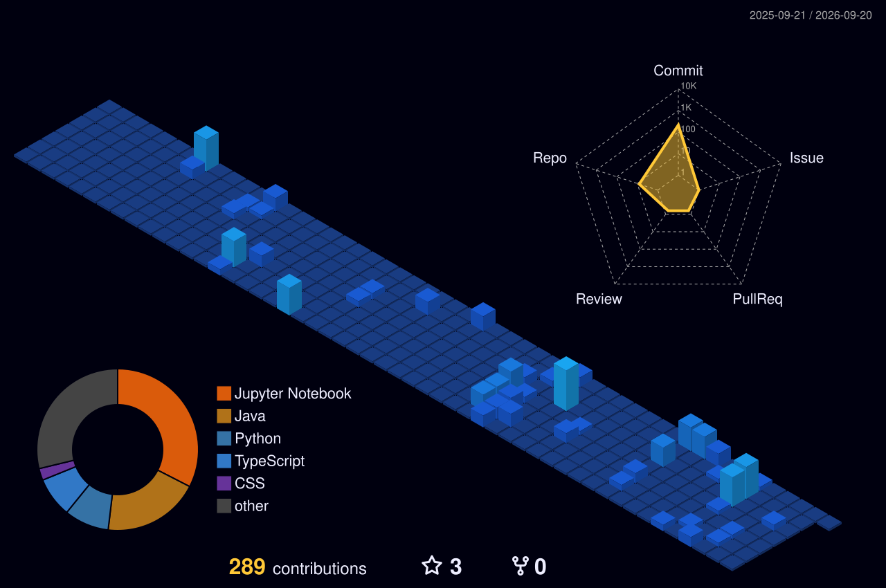

<h1 align="center">Hi, I'm Yarabarla Manidweep 👋</h1>
<h3 align="center">AI Full-Stack Developer (AI FSD)</h3>

  
  
  

  

---

I build full-stack products and integrate AI capabilities — RAG pipelines, LLM agents, and computer vision — directly into web architectures.

## 🧭 About Me

- 🎓 **AI Full-Stack Developer** focusing on end-to-end intelligent applications
- 🛠️ **Full-stack & Backend:** Python, FastAPI, Java, React, Docker, REST APIs
- 🤖 **AI & Data Integration:** Generative AI, RAG Pipelines, Agentic AI, Supabase (`pgvector`)
- 👁️ **Edge AI & Computer Vision:** PyTorch, OpenCV, ResNet-18, NVIDIA Jetson Nano
- 🧠 **Strong focus on** system performance, hybrid vector search, and latency optimization

---

## 🛠️ Tech Stack

### Languages & Full-Stack

### AI, ML & Agentic Systems

### Frameworks, Data & Computer Vision

### Databases & Vector Search

-3ECF8E?style=flat-square&logo=supabase&logoColor=white)

### Tools & Infrastructure

---

## 📊 GitHub Analytics

  

  

---

## 🚀 Featured Projects

### 🧠 Varna-Context | Hyper-Local AI Study Assistant
`Python` `FastAPI` `React` `Supabase (pgvector)` `Gemini API`
> Contextual RAG pipeline converting academic content into localized regional scenarios. Implemented hybrid retrieval using Reciprocal Rank Fusion (RRF) over dense vector embeddings and full-text search to ensure accurate content delivery.

### ⚡ TalkToDB | Natural Language to SQL Engine
`Python` `FastAPI` `PostgreSQL` `SQLite` `React` `Docker`
> Sub-200ms natural language execution engine with automated database schema parsing. Features a built-in self-correction loop with up to 5 automated retry attempts for failed SQL queries.

### 📰 ET Pulse | AI News Intelligence System
`Python` `FastAPI` `LLMs`
> Automated information filter processing raw news streams into concise, noise-free analytical briefs.

---

## 🔬 Edge AI & Specialized Systems

### 🚗 SentinelDrive | Edge Fatigue Detection System
`PyTorch` `OpenCV` `ResNet-18` `NVIDIA Jetson Nano`
> Real-time driver fatigue detection engineered for edge deployment. Built a custom dataset of 500+ facial samples and fine-tuned a ResNet-18 classifier optimized for low-latency inference on Jetson Nano devices.

### 📄 TalentFit | Intelligent Resume Matching Engine
`Python` `NLP` `Data Parsing`
> Automated screening pipeline designed to parse, evaluate, and match candidate resumes against targeted job requisitions.

---

## 📈 Experience & Certifications

- **AI & Computer Vision Intern** — *Vishwa Foundation TBI* *(Jan 2025 – Jun 2025)*
  - Engineered real-time drowsiness detection models and handled model optimization on Jetson Nano edge hardware.
- **NVIDIA Certificate of Competency:** Getting Started with AI on Jetson Nano
- **HackerRank Certifications:** Certified Software Engineer | SQL (Intermediate)
- **Specialized Training:** Full Stack Development with Generative AI & Agentic AI
